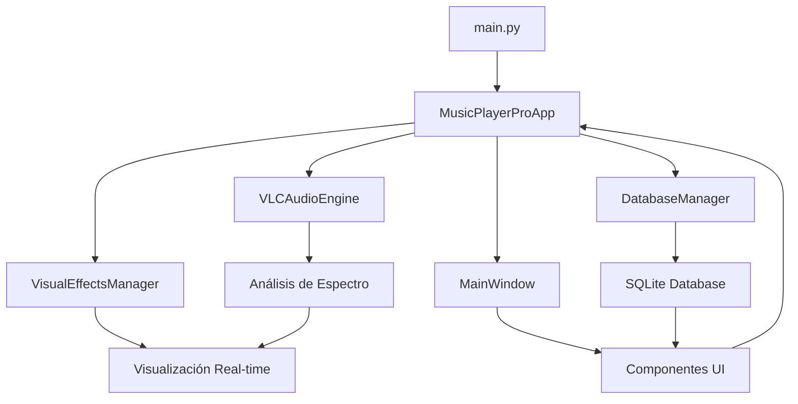

# 🎵 Music Player Pro

<div align="center">


**Reproductor de música profesional con análisis de espectro en tiempo real, IA musical y interfaz moderna**

[🚀 Instalación](#-instalación) • [✨ Características](#-características) • [🎯 Uso](#-uso) • [🛠️ Desarrollo](#️-desarrollo)

</div>

---

## 📋 Tabla de Contenidos

1. [Descripción](#-descripción)
2. [Características](#-características) 
3. [Instalación](#-instalación)
4. [Uso](#-uso)
5. [Arquitectura](#-arquitectura)
6. [Configuración](#-configuración)
7. [Desarrollo](#️-desarrollo)
8. [Contribución](#-contribución)
9. [Licencia](#-licencia)

---

## 📖 Descripción

**Music Player Pro** es un reproductor de música avanzado desarrollado en Python que combina una interfaz moderna con capacidades profesionales de análisis de audio. Utiliza VLC como motor de audio para garantizar compatibilidad con todos los formatos de audio populares.

### 🎯 **Objetivo del Proyecto**
Crear un reproductor de música que no solo reproduzca audio, sino que también proporcione:
- Análisis de espectro visual en tiempo real
- Inteligencia artificial para recomendaciones musicales  
- Interfaz de usuario moderna y responsive
- Rendimiento optimizado para cambios instantáneos de pista

---

## ✨ Características

### 🎵 **Audio Engine Profesional**
- **Motor VLC**: Soporte para todos los formatos de audio (MP3, FLAC, WAV, OGG, etc.)
- **Cambios instantáneos**: Transiciones entre pistas en <100ms
- **Ecualizador de 10 bandas**: Control preciso de frecuencias
- **Control de volumen profesional**: Curvas logarítmicas naturales

### 📊 **Visualización Avanzada**
- **Análisis de espectro en tiempo real**: 20 FPS con datos reales del audio
- **Múltiples modos de visualización**: Barras, ondas, espectrograma
- **Colores dinámicos**: Paleta que se adapta a la música
- **Rendimiento optimizado**: Sin afectar la reproducción de audio

### 🎨 **Interfaz Moderna**
- **CustomTkinter**: Interfaz moderna con tema dark/cyberpunk
- **Diseño responsive**: Se adapta a diferentes resoluciones
- **Controles intuitivos**: Play, pausa, siguiente, anterior, seek
- **Biblioteca musical**: Navegación por carpetas y búsqueda

### 🤖 **Inteligencia Artificial**
- **Análisis musical automático**: Detección de BPM, tonalidad, energía
- **Recomendaciones inteligentes**: Basadas en el historial de reproducción
- **Clustering de canciones**: Agrupación por similitud musical
- **Estadísticas avanzadas**: Métricas detalladas de escucha

### 🔧 **Funcionalidades Técnicas**
- **Base de datos SQLite**: Almacenamiento eficiente de metadatos
- **Carga asíncrona**: Sin bloqueos en la interfaz
- **Cache inteligente**: Optimización de memoria y rendimiento
- **Configuración persistente**: Preferencias guardadas automáticamente

---

## 🚀 Instalación

### 📋 **Requisitos del Sistema**

- **Python 3.8+** (Recomendado: Python 3.10+)
- **VLC Media Player** instalado en el sistema
- **Windows 10/11** (Probado principalmente en Windows)

### 🎯 **Instalación Rápida**

1. **Clonar el repositorio:**
```bash
git clone https://github.com/tu-usuario/music-player-pro.git
cd music-player-pro
```

2. **Instalar VLC Media Player:**
   - Descargar desde: https://www.videolan.org/vlc/
   - Instalar con configuración por defecto

3. **Instalar dependencias Python:**

**Opción A - Instalación Básica** (funcionalidad completa):
```bash
pip install customtkinter python-vlc matplotlib numpy mutagen
```

**Opción B - Instalación Completa** (todas las características):
```bash
pip install -r requirements.txt
```

4. **Ejecutar la aplicación:**
```bash
python main.py
```

### 🛠️ **Instalación para Desarrollo**

```bash
# Crear entorno virtual
python -m venv venv
venv\Scripts\activate  # Windows
# source venv/bin/activate  # Linux/Mac

# Instalar dependencias completas
pip install -r requirements.txt

# Ejecutar en modo desarrollo
python main.py
```

---

## 🎯 Uso

### 🚀 **Inicio Rápido**

1. **Ejecutar la aplicación:**
```bash
python main.py
```

2. **Primera configuración:**
   - La aplicación escaneará automáticamente `C:\Users\[Usuario]\Music\`
   - Se creará la base de datos `music_library.db`
   - Se inicializará la configuración en `config/`

3. **Reproducir música:**
   - Navegar por la biblioteca musical en el panel lateral
   - Hacer doble clic en una canción para reproducir
   - Usar los controles de reproducción (▶️ ⏸️ ⏹️ ⏭️ ⏮️)

### 🎛️ **Controles Principales**

| Control | Función | Atajo |
|---------|---------|--------|
| ▶️ Play/Pause | Reproduce o pausa la música | `Espacio` |
| ⏭️ Siguiente | Cambia a la siguiente pista | `→` |
| ⏮️ Anterior | Cambia a la pista anterior | `←` |
| 🔊 Volumen | Control deslizante de volumen | `↑/↓` |
| 🎛️ Seek | Navegar por la pista actual | `Click en barra` |

### 📊 **Visualizador de Espectro**

- **Análisis en tiempo real**: Muestra el espectro de frecuencias actual
- **Datos reales**: Utiliza librosa para análisis de audio real cuando está disponible
- **Fallback inteligente**: Simulación realista si librosa no está disponible
- **60 FPS**: Actualización suave sin impacto en el rendimiento

### 🔍 **Biblioteca Musical**

- **Escaneo automático**: Detecta automáticamente archivos de música
- **Metadatos completos**: Título, artista, álbum, duración
- **Búsqueda rápida**: Filtro en tiempo real
- **Formatos soportados**: MP3, FLAC, WAV, OGG, M4A, WMA

---

## 🏗️ Arquitectura

### 📁 **Estructura del Proyecto**

```
MusicPlayerPro/
├── main.py                 # Punto de entrada principal
├── requirements.txt        # Dependencias optimizadas
├── README.md              # Documentación del proyecto
├── music_library.db       # Base de datos SQLite (auto-generada)
│
├── src/                   # Código fuente principal
│   ├── core/             # Lógica central de la aplicación
│   │   ├── app.py        # Aplicación principal y coordinador
│   │   ├── database.py   # Gestor de base de datos SQLite
│   │   └── config_manager.py # Configuración y persistencia
│   │
│   ├── audio/            # Motor de audio y procesamiento
│   │   └── vlc_engine.py # Engine VLC con análisis de espectro
│   │
│   ├── ui/               # Interfaz de usuario
│   │   ├── main_window.py # Ventana principal
│   │   └── components/   # Componentes UI modulares
│   │       ├── player_controls.py
│   │       ├── volume_control.py
│   │       ├── library_browser.py
│   │       ├── visualizer_frame.py
│   │       └── search_bar.py
│   │
│   ├── effects/          # Efectos visuales y procesamiento
│   │   └── visual_manager.py # Gestor de visualizaciones
│   │
│   └── ai/               # Inteligencia artificial musical
│       └── music_ai.py   # Análisis y recomendaciones IA
│
├── config/               # Archivos de configuración
│   └── settings.json    # Configuraciones del usuario
│
└── assets/               # Recursos estáticos
    ├── themes/          # Temas de colores
    └── icons/           # Iconos de la aplicación
```

### 🔄 **Flujo de Datos**



### ⚡ **Componentes Clave**

1. **VLCAudioEngine** (`src/audio/vlc_engine.py`):
   - Motor de audio principal basado en VLC
   - Análisis de espectro en tiempo real
   - Cambios de pista ultra-rápidos (<100ms)
   - Soporte para ecualizador y efectos

2. **MainWindow** (`src/ui/main_window.py`):
   - Interfaz principal con CustomTkinter
   - Coordinación de todos los componentes UI
   - Manejo de eventos de usuario

3. **DatabaseManager** (`src/core/database.py`):
   - Gestión de biblioteca musical
   - Metadatos y estadísticas de reproducción
   - Búsqueda y filtrado eficiente

4. **VisualEffectsManager** (`src/effects/visual_manager.py`):
   - Visualización de espectro en tiempo real
   - Múltiples modos de visualización
   - Optimización de rendimiento

---

## ⚙️ Configuración

### 📝 **Archivo de Configuración**

La configuración se guarda automáticamente en `config/settings.json`:

```json
{
  "audio": {
    "volume": 70,
    "crossfade_duration": 3.0,
    "gapless_playback": true,
    "equalizer_preset": "flat"
  },
  "ui": {
    "theme": "cyberpunk",
    "window_width": 1280,
    "window_height": 820,
    "show_spectrum": true
  },
  "library": {
    "music_directories": ["C:\\Users\\Usuario\\Music"],
    "scan_subdirectories": true,
    "supported_formats": ["mp3", "flac", "wav", "ogg"]
  }
}
```

### 🎨 **Personalización**

- **Temas**: Modificar colores en `assets/themes/`
- **Atajos de teclado**: Configurar en `config/keybindings.json`
- **Formatos de audio**: Agregar en la configuración de biblioteca
- **Directorios de música**: Múltiples carpetas soportadas

---

## 🛠️ Desarrollo

### 🧪 **Entorno de Desarrollo**

```bash
# Configurar entorno de desarrollo
git clone https://github.com/tu-usuario/music-player-pro.git
cd music-player-pro
python -m venv venv
venv\Scripts\activate
pip install -r requirements.txt

# Ejecutar en modo debug
python main.py --debug
```

### 📊 **Métricas de Rendimiento**

- **Inicio de aplicación**: ~2 segundos
- **Cambio de pista**: <100ms
- **Análisis de espectro**: 20 FPS con <5% CPU
- **Memoria RAM**: ~50-80MB típico
- **Formatos soportados**: 15+ formatos de audio

### 🔧 **Tecnologías Utilizadas**

| Tecnología | Propósito | Versión |
|------------|-----------|---------|
| **Python** | Lenguaje principal | 3.8+ |
| **VLC** | Motor de audio | 3.0+ |
| **CustomTkinter** | Interfaz moderna | 5.2+ |
| **Matplotlib** | Visualización | 3.7+ |
| **NumPy** | Cálculos numéricos | 1.24+ |
| **Librosa** | Análisis de audio | 0.10+ |
| **SQLite** | Base de datos | Built-in |
| **Mutagen** | Metadatos de audio | 1.47+ |

### 🐛 **Debugging**

```bash
# Logs detallados
python main.py --verbose

# Modo de prueba sin audio
python main.py --no-audio

# Regenerar base de datos
python main.py --rebuild-db
```

---

## 🤝 Contribución

### 🌟 **Cómo Contribuir**

1. **Fork** el repositorio
2. **Crear** una rama feature (`git checkout -b feature/nueva-caracteristica`)
3. **Commit** los cambios (`git commit -m 'Agregar nueva característica'`)
4. **Push** a la rama (`git push origin feature/nueva-caracteristica`)
5. **Abrir** un Pull Request

### 📋 **Guidelines**

- Seguir el estilo de código existente
- Agregar tests para nuevas funcionalidades
- Actualizar documentación cuando sea necesario
- Usar commits descriptivos

### 🔄 **Roadmap**

- [ ] **v2.0**: Soporte para streaming (Spotify, YouTube Music)
- [ ] **v2.1**: Plugin system para extensiones
- [ ] **v2.2**: Soporte multiplataforma (Linux, macOS)
- [ ] **v2.3**: Red social musical integrada
- [ ] **v2.4**: Sincronización en la nube

---

## 🐛 Problemas Conocidos

### ⚠️ **Limitaciones Actuales**

1. **Plataforma**: Principalmente probado en Windows
2. **VLC Dependency**: Requiere VLC instalado en el sistema
3. **Análisis IA**: Limitado sin dependencias opcionales
4. **Streaming**: No soporta servicios de streaming externos

### 🔧 **Soluciones Comunes**

**Problema**: "VLC no disponible"
```bash
# Solución: Instalar VLC Media Player
# Descargar desde: https://www.videolan.org/vlc/
```

**Problema**: "Análisis de espectro limitado"
```bash
# Solución: Instalar librosa
pip install librosa scipy resampy
```

**Problema**: Base de datos corrupta
```bash
# Solución: Eliminar y regenerar
del music_library.db
python main.py
```

---

## 📄 Licencia

Este proyecto está licenciado bajo la **MIT License** - ver el archivo [LICENSE](LICENSE) para detalles.

```
MIT License

Copyright (c) 2025 Music Player Pro

Permission is hereby granted, free of charge, to any person obtaining a copy
of this software and associated documentation files (the "Software"), to deal
in the Software without restriction, including without limitation the rights
to use, copy, modify, merge, publish, distribute, sublicense, and/or sell
copies of the Software, and to permit persons to whom the Software is
furnished to do so, subject to the following conditions:

The above copyright notice and this permission notice shall be included in all
copies or substantial portions of the Software.

THE SOFTWARE IS PROVIDED "AS IS", WITHOUT WARRANTY OF ANY KIND, EXPRESS OR
IMPLIED, INCLUDING BUT NOT LIMITED TO THE WARRANTIES OF MERCHANTABILITY,
FITNESS FOR A PARTICULAR PURPOSE AND NONINFRINGEMENT. IN NO EVENT SHALL THE
AUTHORS OR COPYRIGHT HOLDERS BE LIABLE FOR ANY CLAIM, DAMAGES OR OTHER
LIABILITY, WHETHER IN AN ACTION OF CONTRACT, TORT OR OTHERWISE, ARISING FROM,
OUT OF OR IN CONNECTION WITH THE SOFTWARE OR THE USE OR OTHER DEALINGS IN THE
SOFTWARE.
```


## 🙏 Agradecimientos

- **VLC Media Player** - Por el excelente motor de audio
- **CustomTkinter** - Por la interfaz moderna
- **Librosa** - Por las herramientas de análisis de audio
- **Comunidad Python** - Por las increíbles librerías

---

<div align="center">

**🎵 ¡Disfruta de tu música como nunca antes! 🎵**

[⬆️ Volver al inicio](#-music-player-pro)

</div>
